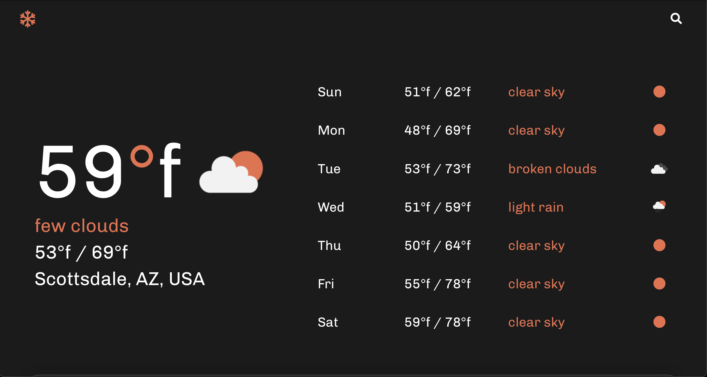

# Project Title

A weather app built with modular es6 Js, and sass.

Live at (https://substanceseven.com/weatherApp/)

## Demo Image

## Built With

* [Webpack](http://www.dropwizard.io/1.0.2/docs/) - Dependency Management
* [Es6](https://www.w3schools.com/js/js_es6.asp) - Modern Js
* [Sass](https://sass-lang.com) - Styling
 
## Authors

* **Max Hannan** - *Initial work* - [maxhannan](https://github.com/maxhannan)

## License

This project is licensed under the MIT License - see the [LICENSE.md](LICENSE.md) file for details

